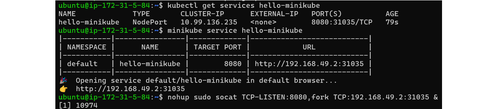

# <p align="center">Kubernetes (K8s) for Beginners</p>

# Containers
- Containers are lightweight, isolated environments that allow applications to run with their own dependencies, libraries, and settings while sharing the same OS kernel.
- They make it easy to develop, ship, and run applications consistently across different environments.
### Use of Containers
- Solve compatibility issues (no "matrix from hell")
- Run applications consistently across different environments (Dev, Test, Prod)
- Reduce setup time for developers
- Enable faster updates and scaling
### Containers vs. Virtual Machines (VMs)
- Containers share the OS kernel, making them lightweight (MBs in size) and fast to start (seconds).
- VMs include a full OS for each instance, making them larger (GBs in size) and slower to start (minutes).
- VMs provide more isolation, but containers offer better efficiency and resource utilization.
### Use Docker to Run Containers
- **Pulling & Running Containers:** Many applications are already available as **Docker images** in public registries like **Docker Hub**. You can pull and run these containers using `docker run`.
    ```bash
    docker run <image_name>
    ```
    - Each command:
      - Downloads the required image (if not already available).
      - Creates a **container** from the image.
      - Runs the application inside the container.
    - The `-d` flag runs the containers in **detached mode** (in the background).
        ```bash
        docker run <image_name>
        ```
### Docker Image vs. Docker Container
- A **Docker Image** is a **blueprint** or **template** used to create Docker containers. It is **read-only** and contains everything needed to run an application, including code, runtime, dependencies, and configurations. Docker images are built using a **Dockerfile** and are stored in **repositories** like Docker Hub for sharing and reuse.
- A **Docker Container** is a **running instance** of a Docker image. Unlike images, containers are **read-write**, meaning changes can be made while they are running. Containers exist only when they are actively running on a **host machine**. Multiple containers can be created from the same image, allowing for **scalability** and **consistency** across environments. 🚀
### Why Use Containers? (Dev & Ops Benefits)
- **Before Containers (Traditional Deployment):**
  - Developers wrote code and handed it over to Operations.
  - Operations set up environments manually, leading to **inconsistencies**.
  - "Works on my machine" problem.
- **With Containers (Dockerized Deployment):**
  - **Developers** write a `Dockerfile` to define everything needed for the app.
  - **Operations** simply run the image to deploy the app—same across all environments.
  - Reduces **configuration drift** and **dependency issues**.
### Creating Your Own Docker Image
- **Steps:**
  1. **Write a `Dockerfile`:**  
     ```dockerfile
     FROM node:14
     WORKDIR /app
     COPY . .
     RUN npm install
     CMD ["node", "server.js"]
     ```
  2. **Build the Image:**  
     ```bash
     docker build -t myapp .
     ```
  3. **Run a Container from the Image:**  
     ```bash
     docker run -d -p 3000:3000 myapp
     ```
- This ensures the app runs the same way in **Development**, **Testing**, and **Production**.

# Container Orchestration
- Container orchestration is the process of **automating deployment, scaling, networking, and management** of containerized applications. When running applications in **production**, managing multiple containers manually becomes difficult. Orchestration tools handle:
  - **Scaling**: Increase or decrease the number of containers based on traffic.
  - **Load Balancing**: Distribute traffic across multiple containers.
  - **Self-healing**: Restart failed containers automatically.
  - **Networking**: Manage communication between containers.
### Orchestration Technologies
- There are several container orchestration tools available:
  - **Docker Swarm:** Built into Docker, easy to set up, but lacks advanced features.
  - **Kubernetes:** Most popular, highly scalable, supports complex applications.
  - **Apache Mesos:** Powerful but complex, used for large-scale deployments.
- Among these, **Kubernetes** is the most widely used because of its flexibility, cloud provider support, and large community.

# Kubernetes
- Kubernetes is an open-source system for **automating deployment, scaling, and management of containerized applications**.
- It was developed by Google and is now widely used for orchestrating containers across multiple machines.
- Kubernetes (**K8s**) is the leading container orchestration platform. It helps in:
  - **High Availability**: Application remains online even if some containers or nodes fail.
  - **Auto-scaling**: New containers are added automatically based on demand.
  - **Load Balancing**: Ensures traffic is distributed evenly.
  - **Rolling Updates & Rollbacks**: Deploy new versions without downtime.
  - **Resource Management**: Efficient use of CPU & memory across nodes.
### Kubernetes Architecture
#### Nodes (Worker Nodes)
- A **Node** is a **physical or virtual machine** where Kubernetes is installed. It is responsible for **running application workloads** inside containers.
- Kubernetes launches **containers** on these worker nodes.
- Previously, worker nodes were called **"Minions"**.
- If a **node fails**, the application running on it will **go down**. Use **multiple nodes** in a **cluster** to ensure **high availability**.
#### Cluster
- A **Cluster** is a group of **multiple nodes** that work together to run applications reliably.  
- If one node **fails**, another node takes over.
- **Load sharing** is done across multiple nodes to improve performance.  
#### Master Node (Control Plane)
- The **Master Node** is responsible for **managing the cluster**. It ensures that applications run efficiently across nodes.
- The master node:
  - **Monitors worker nodes**
  - **Manages workloads** and **schedules containers**
  - **Handles failures** and redistributes workloads
### Kubernetes Components
- When you install Kubernetes, it includes several **key components**:
  - **API Server** – The **frontend** of Kubernetes that interacts with users, CLI tools (`kubectl`), and other components.
  - **etcd (Key-Value Store)** – Stores **cluster state** and ensures **consistency** across all nodes.
  - **Scheduler** – Assigns **workloads (pods)** to available worker nodes based on resource availability.
  - **Controllers** – Monitors the cluster, detects failures, and **ensures self-healing** by restarting failed components.
  - **Container Runtime** – The software that **runs containers**, such as **Docker, containerd, or CRI-O**.
  - **kubelet** – An **agent** running on each worker node that communicates with the control plane and **ensures containers run correctly**.
- **How Kubernetes Works:**
  1. **A user requests a new application deployment using `kubectl`.**
  2. **The API Server** receives the request and updates the **etcd datastore**.
  3. **The Scheduler** assigns the application to an available worker node.
  4. **The Controller** ensures the application is running and reschedules if needed.
  5. **The Kubelet** on the worker node ensures the containers run as expected.
  6. **The application is now accessible!**
### Master vs Worker Nodes in Kubernetes
- In Kubernetes, there are **two types of nodes**:
  1. **Master Node** (Control Plane)
  2. **Worker Node** (Minions)
- Each node type runs different components that allow Kubernetes to function properly.
- **Master Node (Control Plane):**
  - The **Master Node** is responsible for **managing the entire cluster**. It handles **orchestration, scheduling, and cluster management**.
  - **Components of the Master Node:**
    - **kube-apiserver:** The **entry point** for all Kubernetes commands (kubectl, UI, API).
    - **etcd:** A **key-value store** that stores the cluster state.
    - **controller-manager:** Manages controllers (ReplicationController, Node Controller, etc.).
    - **scheduler:** Assigns workloads (Pods) to Worker Nodes.
- **Worker Node (Minion):**
  - A **Worker Node** runs application containers inside **Pods**.
  - **Components of the Worker Node:**
    - **kubelet:** Talks to the **Master Node**, ensures pods are running.
    - **Container Runtime:** Runs containers (Docker, containerd, CRI-O).
    - **kube-proxy:** Manages networking & load balancing within the cluster.
### kubectl (Kube Control)
- `kubectl` is the **command-line tool** for interacting with a Kubernetes cluster.
- **Basic kubectl Commands:**
  - `kubectl run hello-minikube` → Deploy an application.
  - `kubectl cluster-info` → Get cluster details.
  - `kubectl get nodes` → List all nodes in the cluster.
- **kubectl** is the tool used to **manage** and **deploy applications** in Kubernetes.

# Evolution of Kubernetes and Container Runtimes
- **Early Days of Kubernetes with Docker:**
  - In the beginning, **Docker** was the only container technology available, making it simple and widely adopted.
  - Kubernetes (K8s) was introduced as a container orchestration tool specifically for Docker containers.
  - At that time, Kubernetes **only supported Docker** and did not work with other container runtimes.
- **Introduction of the Container Runtime Interface (CRI):**
  - As Kubernetes became the most popular container orchestration tool, new container runtimes emerged.
  - To allow Kubernetes to support multiple container runtimes, **the Container Runtime Interface (CRI) was introduced**.
  - CRI allows Kubernetes to run **any container runtime** as long as it follows **Open Container Initiative (OCI) standards**.
- **Open Container Initiative (OCI) Standards:**
  - To standardize container runtimes and images, the **Open Container Initiative (OCI)** defined two key specifications:
    - **Image Specification**: Defines how container images should be built and stored.
    - **Runtime Specification**: Defines how container runtimes should execute containers.
  - Any container runtime that follows these OCI standards can integrate with Kubernetes through the **CRI**.
- **DockerShim: Temporary Support for Docker:**
  - Since **Docker was created before CRI**, it did not originally support the CRI standard.
  - However, Docker was the most widely used container runtime, so Kubernetes had to continue supporting it.
  - To solve this, Kubernetes introduced **Dockershim**, a component that allowed Kubernetes to communicate with Docker **without needing CRI**.
  - While other container runtimes worked directly through CRI, Docker continued to function **outside of CRI** using Dockershim.
- **The Role of containerd in Kubernetes:**
  - Docker was more than just a container runtime; it included features like **volume management, authentication, security, and networking**.
  - However, the actual container runtime inside Docker was **`runC`**, which was managed by **`containerd`**.
  - Since **containerd is CRI-compatible**, it can work **directly** with Kubernetes **without requiring Docker**. This allowed Kubernetes to **adopt containerd as its runtime**, eliminating the need for Docker.
- **Deprecation and Removal of Dockershim:**
  - Over time, maintaining Dockershim became unnecessary and added complexity.
  - To simplify Kubernetes, the **Dockershim component was removed in Kubernetes v1.24**.
  - This meant that Kubernetes would **no longer support Docker directly** as a container runtime.
- **Docker Images Still Work with Kubernetes:**
  - Even though Dockershim was removed, **Docker images are still compatible with Kubernetes**.
  - This is because Docker images follow **OCI’s Image Specification**, making them usable with **containerd** and other OCI-compliant runtimes like **CRI-O**.
Here’s your content formatted into **clear paragraph points** for your notes:  
### Containerd, CLI Tools, and CRI in Kubernetes
#### Containerd as a Separate Project
- Although **containerd** was originally a part of Docker, it has now become an **independent project** and is a member of the **Cloud Native Computing Foundation (CNCF)**.
- This means you can install **containerd separately**, without needing to install Docker.
- If you don’t require Docker’s additional features (such as volume management, authentication, or networking), you can use **containerd alone** as your container runtime.
#### CTR: The Debugging Tool for Containerd
- When you install containerd, it includes a command-line tool called **`ctr`**. However, **`ctr` is not designed for production use**.
- Instead, it is mainly used for **debugging containerd**. Since `ctr` is not user-friendly, it is not recommended for managing containers in a production environment.
#### Nerdctl: A Docker-Like CLI for Containerd
- A **better alternative** to `ctr` is **`nerdctl`**, which is also called **Node Control Tool**. It is a command-line tool that provides a user experience **similar to Docker CLI**.
- With `nerdctl`, you can manage containers using familiar commands, making it easier for users who are already familiar with Docker.  
#### Container Runtime Interface (CRI)
- **CRI (Container Runtime Interface)** is a single standardized interface that allows Kubernetes to connect with **CRI-compatible container runtimes**, such as **containerd, CRI-O, and Rocket**.
- This interface enables Kubernetes to work with different container runtimes seamlessly.
#### Crictl: CLI Tool for CRI-Compatible Runtimes
- The Kubernetes community has developed **`crictl`** (CRI Control) as a **command-line tool to interact with CRI-compatible container runtimes**.
- Unlike `nerdctl`, which is specific to containerd, `crictl` works **across multiple container runtimes** that support CRI.
- **It must be installed separately** and is widely used for debugging and interacting with Kubernetes container runtimes.  
#### Updated CRI Endpoints in Kubernetes v1.24
- In Kubernetes **v1.24**, the **default CRI endpoints changed**.
- As a result, users need to manually set the **CRI endpoint** in `crictl` to ensure proper communication with the container runtime.
- This update was introduced to improve flexibility and compatibility across different Kubernetes environments.

# Setup Kubernetes using Minikube
- [Refer Here](https://kubernetes.io/docs/tasks/tools/) for the Official docs.
- We install `minikube` on Ubuntu Linux Instance.
  - **The Resource Requirements:**
    - Instance Type → `t3.medium`
    - Storage Volume → `20 GB`
  - **Security Group Required Ports:**
    - `22` → SSH access to the instance
    - `2379-2380` → etcd communication
    - `6443` → API server (required to communicate with kubectl)
    - `10250` → Kubelet API
    - `10251` → Kube-scheduler
    - `10252` → Kube-controller-manager
    - `30000-32767` → NodePort services (for exposing applications)
### First Install `kubectl`
  - [Refer Here](https://kubernetes.io/docs/tasks/tools/#kubectl) for the Official docs.
  - Install `kubectl` using Official docs and Verify the Installation
    ```sh
    kubectl version --client
    ```
  
### Install `minikube`
- [Refer Here](https://minikube.sigs.k8s.io/docs/start/?arch=%2Flinux%2Fx86-64%2Fstable%2Fbinary+download) for the Official docs.
- **First Install `Container or virtual machine manager`:**
  - Install `Docker`
- **Then Install Minikube:**
  - Install `minikube` using Official docs and Start `minikube` with `Docker` driver
    ```sh
    minikube start --driver=docker
    ```
  - Verify the Installation
    ```sh
    minikube status
    ```
  
- **Note:**
  - When Minikube uses Docker as its driver, it creates an internal network. This allows applications to communicate internally within that network.
  - However, external access is not directly available. To access applications from outside, we need to expose them using a **NodePort** and use `socat` to forward traffic from the host machine’s IP to the internal Minikube network.
    ```sh
    sudo apt update && sudo apt install -y socat
    # Install Socat.
    nohup sudo socat TCP-LISTEN:8080,fork TCP:192.168.49.2:30566 &
    # Run as a background service.
    # → '8080' is the Host Instance Port
    # → '192.168.49.2:30556' is the Minikube IP with NodePort.
    ```
  
  - **Kill the Existing `socat` Process:**
    ```sh
    sudo ss -tulnp | grep 8080
    # Find the Process ID (PID) of the Running 'socat'.
    sudo kill <pid>
    # Kill the Existing 'socat' Process.
    ```

# Pods
- [Refer Here](https://kubernetes.io/docs/concepts/workloads/pods/) for the Official docs.  
- A **POD** is the smallest unit in Kubernetes that runs a **containerized application**.
- Kubernetes does **not** run containers directly on worker nodes. Instead, it runs **PODs**, which contain the containers.
- Each **POD** usually runs **one container**, but it can run multiple if needed.
### Scaling Applications with PODs
- If more users start using your application, you need to **increase** the number of running instances.
- To **scale up**, you **create new PODs** instead of adding more containers to an existing POD.
- If a single node is full, Kubernetes can **deploy new PODs on another node** in the cluster.
- To **scale down**, you simply **delete unnecessary PODs**.
- Kubernetes does **not** add more containers to an existing Pod for scaling; instead, it creates additional Pods with the same application instance.
### Multi-Container Pods
- A Pod **can** contain multiple containers, but typically **only when needed**.
- Common use cases:
  - A **main application container** (e.g., web server).
  - A **helper container** for supporting tasks (e.g., logging, file processing).
- **Benefits of Multi-Container Pods:**
  - Containers inside a Pod **share storage** (volumes).
  - Containers inside a Pod **share the same network namespace** (communicate via `localhost`).
  - If the Pod is deleted, all containers inside it are also removed.
### Pods vs. Standalone Docker Containers
- **Standalone Docker:**
  - Requires manually linking helper containers to the main application.
  - Must explicitly define networks and shared volumes.
  - Containers must be manually restarted and mapped to each other.
- **Kubernetes Pods:**
  - Handles networking and storage sharing **automatically**.
  - All containers in a Pod are created, started, and terminated **together**.
  - **More scalable and manageable** for production workloads.
### Deploying a Pod with `kubectl`
- **To create a POD running an Nginx container:**
  ```sh
  kubectl run nginx --image=nginx
  ```  
    - `kubectl run` → Creates a POD.  
    - `--image=nginx` → Uses the Nginx image from Docker Hub.  
- **To check if the POD is running:**
  ```sh
  kubectl get pods
  ```  
    - This will show the status of the POD, such as:
      - `ContainerCreating` → The container is being set up.
      - `Running` → The container is successfully running.
- **Commands:**
  ```sh
  kubectl describe pod <pod_name>
  # Shows more details about the Pod.
  kubectl get pods -o wide
  # Shows additional details of the Pods.
  kubectl delete pod <pod_name>
  # To remove a Pod.
  ```
- By default, a newly created Pod **is not accessible** externally. We need **Services** to expose the Pod to users.
### Pod Lifecycle Events
- **Scheduled** → Kubernetes assigns the Pod to a node.
- **Pulled** → Downloads the container image.
- **Created** → Creates the container.
- **Started** → The container starts running.

# YAML (Yet Another Markup Language)
- YAML is a human-readable data format often used for configuration files. It is simple and easy to understand.
  1. **Key-Value Pairs (Basic Data):** YAML stores data as **key-value pairs**, similar to a dictionary.
      - Example:
        ```yaml
        fruit: apple
        vegetable: carrot
        ```
        - `fruit` is the **key**, and `apple` is the **value**.  
        - `vegetable` is the **key**, and `carrot` is the **value**.
  2. **Lists (Arrays):** YAML can store multiple values as a list (also called an **array**).
      - Example:
        ```yaml
        fruits:
          - orange
          - apple
        vegetables:
          - carrot
          - tomato
        ```
        - The **dash (-)** indicates a list item.  
        - **Lists maintain order** (first item stays first).  
  3. **Dictionaries (Maps):** A dictionary (or map) stores **multiple properties** for an item.
      - Example:
        ```yaml
        banana:
          calories: 105
          fat: 0.4
        grapes:
          calories: 62
          fat: 0.3
        ```
        - `banana` and `grapes` are **keys**.
        - Inside each key, there are **sub-keys** like `calories` and `fat`.
      - **Dictionaries are unordered**, meaning their items don’t have a fixed order.
- Any line that starts with `#` is a comment and is ignored by YAML.
### Dictionary vs List vs List of Dictionaries
- **Dictionary (Map)** → Store **different properties** of a **single object**.
- **List (Array)** → Store **multiple items** of the **same type**.
- **List of Dictionaries** → Store **detailed information** about **multiple objects**.
  - **Example of a List of Dictionaries:**
    ```yaml
    fruits:
      - name: banana
        calories: 105
        fat: 0.4
      - name: grapes
        calories: 62
        fat: 0.3
    ```
    - Each item in `fruits` is a **dictionary inside a list**.

# Kubernetes YAML File
- Kubernetes uses **YAML files** to define resources like Pods, Deployments, and Services.
- YAML helps organize configurations in a structured way.
### Basic Structure of a Kubernetes YAML File
- Every Kubernetes YAML file has four main parts:
  1. **apiVersion** – Defines which version of the Kubernetes API to use.
  2. **kind** – Specifies the type of object (e.g., Pod, Deployment).
  3. **metadata** – Contains information like name and labels.
  4. **spec** – Defines the details of the object, like which container to use.
### Example:
- **YAML for a Pod:**
  ```yaml
  apiVersion: v1
  kind: Pod
  metadata:
    name: myapp-pod
    labels:
      app: myapp
      type: front-end
  spec:
    containers:
      - name: nginx-container
        image: nginx
  ```
- **Explanation of Each Section:**
  - **apiVersion: v1** → Uses version 1 of the API.
  - **kind: Pod** → Defines this as a Pod.
  - **metadata** → Includes:
    - **name** → The name of the Pod (`myapp-pod`).
    - **labels** → Tags for identifying this Pod (`app: myapp`, `type: front-end`).
  - **spec** → Specifies the container details:
    - **containers** → A list of containers inside the Pod.
      - **name** → The name of the container (`nginx-container`).
      - **image** → The Docker image to use (`nginx`).
- **Creating a Pod in Kubernetes:**
  1. **Save the YAML file** as `pod-definition.yml`.
  2. **Run the following command to create the Pod:**
     ```sh
     kubectl create -f pod-definition.yml
     ```
- **Checking Pod Status:**
  - **List all running Pods:**
    ```sh
    kubectl get pods
    ```
    - Shows Pod name, status, and restart count.

  - **Get detailed Pod information:**
    ```sh
    kubectl describe pod myapp-pod
    ```
    - Displays Pod details like labels, container info, events, and IP address.

### Difference Between `kubectl create -f` and `kubectl apply -f`
- Both commands are used to create Kubernetes resources from a YAML file, but they have key differences in behavior and use cases.
  1. **`kubectl create -f pod-definition.yml`:**
     - **Creates a new resource** but **fails if the resource already exists**.
     - **Does not support updates**. If you modify the YAML file and run the command again, it will throw an error saying the resource already exists.
     - Typically used when deploying a resource for the first time.
  2. **`kubectl apply -f pod-definition.yml`:**
     - **Creates the resource if it does not exist**, but **updates it if it already exists**.
     - It **works declaratively**, meaning Kubernetes will only update the parts that have changed in the YAML.
     - Recommended for managing resources efficiently in a production environment.
- **Example Scenario:**
  1. Initial Deployment:
     ```bash
     kubectl create -f pod-definition.yml
     ```
  2. Modify the YAML file (e.g., change the container image)
  3. Apply the changes:
     ```bash
     kubectl apply -f pod-definition.yml
     ```

# Kubernetes Controllers
### Replication Controller
- **Controllers** in Kubernetes are responsible for monitoring and managing resources.
- The **Replication Controller** ensures that a specified number of **Pods** are running at all times.
- **Use of Replication Controller:**
  1. **High Availability**
     - If one Pod fails, another will take over to keep the application running.
     - Even if you need only one Pod, the Replication Controller will restart it if it crashes.
  2. **Load Balancing & Scaling**
     - When traffic increases, new Pods can be created automatically.
     - If a node runs out of resources, new Pods can be scheduled on other nodes.
#### Creating a Replication Controller (Example: rc-definition.yml)
- The definition file contains:
  - `apiVersion: v1` (since it is an older technology)
  - `kind: ReplicationController`
  - `metadata` (name, labels, etc.)
  - `spec` (includes **template** for Pod creation and **replicas** count)
- ReplicationController YAML File:
  ```yaml
  apiVersion: v1
  kind: ReplicationController
  metadata:
    name: myapp-replicationcontroller
    labels:
      app: myapp
      type: front-end
  spec:
    replicas: 3
    selector:
      type: front-end
    template:
      metadata:
        labels:
          app: myapp
          type: front-end
      spec:
        containers:
        - name: nginx-container
          image: nginx
  ```
- **To create a Replication Controller:** `kubectl create -f rc-definition.yml`
- **To check the Replication Controller:** `kubectl get replicationcontroller`
- **To check the Pods:** `kubectl get pods`
### ReplicaSet
- **Replication Controller** is an older technology. **Replica Set** is the newer, recommended method.
- Ensures a specific number of Pods are always running.
- **If a Pod fails**, the ReplicaSet creates a new one. **If extra Pods exist**, the ReplicaSet removes them.
- Uses **labels and selectors** to identify the Pods it should manage.
#### Creating a Replica Set (Example: replicaset-definition.yml)
- The definition file contains:
  - `apiVersion: apps/v1` (newer API version)
  - `kind: ReplicaSet`
  - `metadata` (name, labels, etc.)
  - `spec` (includes **template** for Pod creation, **replicas** count, and **selector**)
- The key difference:
  - **Replica Set** requires a **selector** to match labels with Pods.
- ReplicaSet YAML File:
  ```yaml
  apiVersion: apps/v1
  kind: ReplicaSet
  metadata:
    name: myapp-replicaset
    labels:
      app: myapp
      type: front-end
  spec:
    replicas: 3
    selector:
      matchLabels:
        type: front-end
    template:
      metadata:
        labels:
          app: myapp
          type: front-end
      spec:
        containers:
        - name: nginx-container
          image: nginx
  ```
- **Commands:**
  ```sh
  kubectl create -f replicaset-definition.yml
  # Creates a ReplicaSet
  kubectl get replicaset
  # Lists all ReplicaSets
  kubectl get pods
  # Lists Pods
  kubectl delete replicaset myapp-replicaset
  # Deletes a ReplicaSet (and its Pods)
  kubectl replace -f replicaset-definition.yml
  # Updates a ReplicaSet
  kubectl scale --replicas=6 -f replicaset-definition.yml
  # Scales the ReplicaSet to 6 replicas
  ```
#### Scaling a ReplicaSet
- **Increase the number of Pods** from 3 to 6 using:
  ```sh
  kubectl scale --replicas=6 -f replicaset-definition.yml
  kubectl scale replicaset <name_of_replicaset> --replicas=6
  ```
- Alternatively, update the **replicas** field in the **YAML file** and run:
  ```sh
  kubectl replace -f replicaset-definition.yml
  ```
#### Editing a Running ReplicaSet Without a YAML File
- **Command:**  
   ```bash
   kubectl edit replicaset <name_of_replicaset>
   ```
   - This opens the ReplicaSet configuration in a text editor.
   - The file is **temporary** and exists only in Kubernetes memory.
- **Apply Changes:**
  - Change the number of desired replicas, Save & Exit. Once saved, Kubernetes automatically applies the changes.
  - If changes involve **Pod Containers** (e.g., updating the image), simply editing the ReplicaSet **won’t** replace existing Pods.
    - Delete Existing Pods
    - The ReplicaSet will automatically create new Pods with the updated configuration.
### Replication Controller vs. Replica Set
- **Replication Controller** is an older technology.
- **Replica Set** is the newer, recommended method.
- Both serve the same purpose but work slightly differently.

# Labels and Selectors in Kubernetes
- **Labels** are used to tag Kubernetes objects like **Pods** with specific attributes.
- **Selectors** help identify and filter objects based on labels.
- **Example:**
  - If we label all frontend Pods with `tier: front-end`, a **ReplicaSet** can monitor them using a selector:
    ```yaml
    selector:
      matchLabels:
        tier: front-end
    ```  
### Use of Labels
- Helps Kubernetes manage and organize Pods efficiently.
- Allows **ReplicaSets** to identify which Pods to monitor and manage.

# Kubernetes Deployment
- A **Deployment** in Kubernetes is a higher-level object that **manages ReplicaSets and Pods** to ensure **scalability, updates, and rollbacks** efficiently.
- **Key Features of Deployments:**
  - Ensures a specified number of Pods are running at all times.
  - Automatically creates and manages **ReplicaSets**.
  - Supports **rolling updates** to deploy new versions of an application **without downtime**. New Pods replace old ones step by step.
  - Provides **rollback capabilities** in case an update fails.
  - Allows **pausing and resuming** updates for controlled changes.
### Creating a Deployment (Example: `deployment-definition.yml`)
- A Deployment file is similar to a ReplicaSet file, but the `kind` is set to **Deployment**.
- Deployment YAML File:
  ```yaml
  apiVersion: apps/v1
  kind: Deployment
  metadata:
    name: myapp-deployment
    labels:
      app: myapp
      type: front-end
  spec:
    replicas: 3
    selector:
      matchLabels:
        type: front-end
    template:
      metadata:
        labels:
          app: myapp
          type: front-end
      spec:
        containers:
        - name: nginx-container
          image: nginx
  ```
- **Commands:**
  ```sh
  kubectl apply -f deployment.yml
  # Create a Deployment**
  kubectl get deployments
  # Get Deployments
  kubectl get all
  # Displays the Deployment, ReplicaSets, and running Pods.
  kubectl set image deployment/myapp-deployment nginx-container=nginx:latest
  # Updates the Deployment to use a new 'nginx:latest' image. (e.g., Change Image)
  kubectl rollout undo deployment myapp-deployment
  # Rollback to the Previous Version
  kubectl scale deployment myapp-deployment --replicas=5
  # Scale Deployment (Increases the number of Pods)
  kubectl edit deployment myapp-deployment
  # Editing a Deployment Without YAML File (Opens the Deployment configuration for direct editing.)
  kubectl delete deployment myapp-deployment
  # Deleting a Deployment (Deletes the Deployment, along with the associated ReplicaSet and Pods.)
  ```
### Deployment Updates and Rollbacks
#### Rollouts and Versioning
- When you **create** or **update** a deployment, it triggers a **rollout**.
- A rollout is the process of **gradually updating** your application.
- Each rollout creates a new **deployment revision** (e.g., Revision 1, Revision 2).
- If needed, you can **rollback** to a previous version.
- **Checking Rollout Status & History:**
  - To check rollout progress:
    ```
    kubectl rollout status deployment/myapp-deployment
    ```
  - To check previous versions:
    ```
    kubectl rollout history deployment/myapp-deployment
    ```
#### Deployment Strategies
- **Recreate Strategy**:
  - Stops all running instances before deploying the new version.
  - **Application goes down** temporarily.
- **Rolling Update (Default Strategy)**:
  - Updates one instance at a time.
  - **Application remains available** during the update.
#### Updating a Deployment
- Update by modifying the `deployment-definition.yml` file and applying changes:
  ```
  kubectl apply -f deployment-definition.yml
  ```
- OR update the image directly using:
  ```
  kubectl set image deployment/myapp-deployment nginx=nginx:1.9.1
  ```
- If using `kubectl set image`, the YAML file may become outdated.
#### How Upgrades Work
- A **new ReplicaSet** is created for the updated version.
- The old ReplicaSet is gradually **scaled down** while the new one is **scaled up**.
- You can see this using:
  ```
  kubectl get replicasets
  ```
#### Rolling Back a Deployment
- If an update has issues, you can **rollback** using:
  ```
  kubectl rollout undo deployment/myapp-deployment
  ```
- This **removes the new version** and brings back the old one.

# Kubernetes Networking
- Every **Pod** in Kubernetes gets its own **IP address** (e.g., `10.244.0.2`).
- This is different from Docker, where each **container** gets an IP.
- **Pods communicate using these internal IPs** inside the Kubernetes network.
- The Kubernetes cluster creates a **private network (e.g., `10.244.0.0`)** for all Pods.
### Single-Node Kubernetes Cluster
- The **node itself has an IP address** (e.g., `192.168.1.2`).
- If using **Minikube**, this IP belongs to the **Minikube VM**, not your laptop.
- **Pods within the node** can talk to each other using their **internal IPs**.
- **Issue:** Pod IPs may change when Pods restart, so using these IPs for communication is not reliable.
### Multi-Node Kubernetes Cluster
- Each **node has its own IP** (e.g., `192.168.1.2`, `192.168.1.3`).
- Each node assigns **Pod IPs within the same range (`10.244.0.0`)**, which **creates conflicts**.
- **Kubernetes does NOT automatically configure networking** for multiple nodes.
- Kubernetes expects **a network solution** where:
  - **All Pods can communicate with each other without NAT** (Network Address Translation).
  - **Nodes can communicate with all Pods and vice versa**.
### Kubernetes Network Solutions
- To solve multi-node networking issues, we use **CNI (Container Network Interface) plugins** like:
  - **Flannel**
  - **Calico**
  - **WeaveNet**
  - **Cilium**
  - **VMware NSX-T** (for VMware environments)
- Each solution **assigns unique IPs to Pods across nodes** and manages **routing between nodes**.
### Cluster Networking with Calico
- **Calico assigns different network addresses** (e.g., `10.244.1.0`, `10.244.2.0`) to different nodes.
- It **creates a virtual network** where all Pods and Nodes can communicate.
- Uses **routing techniques** to enable cross-node Pod communication.
- Once set up, **all Pods can talk to each other using their assigned IPs**.

# Kubernetes Services
- **Kubernetes Services** help different components inside and outside an application communicate with each other.
- They allow **pods to interact** with other pods, users, or external data sources.
- Services help in **loosely coupling** microservices, making communication more manageable.
- **Example of Communication Issue in Kubernetes:**
  - Pods run in an **internal network** that is not accessible from the outside.
  - A pod may have an IP (e.g., `10.244.0.2`), but an external user cannot access it directly.
  - **Solution:** Use a **Service** to expose the pod externally.
### Types of Kubernetes Services
#### 1. ClusterIP (Default Service Type)
- Used to allow communication between different **Pods** within a Kubernetes cluster.
- **Pods** (frontend, backend, database) have dynamic IPs, which change when they restart.
- Creates a **virtual IP** inside the cluster for internal communication.
- Instead of using pod IPs, **ClusterIP Service** groups multiple pods and provides a **single static IP** inside the cluster.
- This makes it easier for frontend pods to connect to backend pods, backend to database, etc.
- **Example Service Definition (YAML):**
  ```yaml
  apiVersion: v1
  kind: Service
  metadata:
    name: back-end
  spec:
    type: ClusterIP
    ports:
      - targetPort: 80
        port: 80
    selector:
      app: myapp
      type: back-end
  ```
- **Commands:**
  ```bash
  kubectl create -f service-definition.yml
  # Creates the Service
  kubectl get services
  # Check services
  ```
#### 2. NodePort (Exposes Service Outside the Cluster)
- Used to **expose an application** running in Kubernetes to **external users** (outside the cluster).
- Exposes a pod on a specific port of a **Kubernetes node**.
- Assigns a **high-range port (30000–32767)** to the service.
- External users can access the pod using `http://<Node_IP>:<NodePort>`.
- **How NodePort Works:**
  - **3 Ports in NodePort Service:**
    1. **TargetPort** → The port on the pod (e.g., `80`).
    2. **Port** → The port on the service (e.g., `80`).
    3. **NodePort** → The external port on the node (e.g., `30008`).
  - Traffic flows:
    - External user → **NodePort** (`30008`) → **Service Port** (`80`) → **TargetPort** (`80` on pod).
- **Defining a NodePort Service in YAML: `service-definition.yml`**
  ```yaml
  apiVersion: v1
  kind: Service
  metadata:
    name: myapp-service
  spec:
    type: NodePort
    ports:
      - targetPort: 80
        port: 80
        nodePort: 30008
    selector:
      app: myapp
  ```  
  - **Key points:**
    - **`targetPort`**: Pod’s port (`80`).
    - **`port`**: Service’s port (`80`).
    - **`nodePort`**: External access port (`30008`).
    - **`selector`**: Links service to pods with a label (`app: myapp`).
- **Commands:**
  ```bash
  kubectl create -f service-definition.yml
  # Creates the Service
  kubectl get services
  # Check services
  ```
- **Drawback**: Users must know the **Node's IP** and the **NodePort**, which is not ideal.
#### 3. LoadBalancer (For Cloud Environments)
- Provides a **single external URL** for the application.
- Works only in **cloud providers** (AWS, GCP, Azure, etc.).
- Kubernetes automatically creates and manages a **cloud load balancer**.
- This LoadBalancer distributes traffic to available **NodePort services**.
- **Example YAML Definition**:
  ```yaml
  apiVersion: v1
  kind: Service
  metadata:
    name: front-end
  spec:
    type: LoadBalancer
    ports:
      - targetPort: 80
        port: 80
    selector:
      app: myapp
      type: front-end
  ```
- **Commands:**
  ```bash
  kubectl create -f service-definition.yml
  # Creates the Service
  kubectl get services
  # Check services
  ```
- It assigns an **External IP**, which may take time to be available.